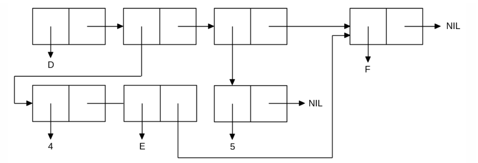

<p align="center"><b>МОНУ НТУУ КПІ ім. Ігоря Сікорського ФПМ СПіСКС</b></p>
<p align="center">
<b>Звіт з лабораторної роботи 1</b><br/>
"Обробка списків з використанням базових функцій"<br/>
дисципліни "Вступ до функціонального програмування"
</p>
<p align="right"> <b>Студент(-ка)</b>: <i>Гнатюк Софія Валентинівна КВ-12</i><p>
<p align="right"><b>Рік</b>: <i>2024</i><p>
  
### Загальне завдання

#### 1.
Створіть список з п'яти елементів, використовуючи функції LIST і CONS . Форма створення списку має бути одна — використання SET чи SETQ (або інших допоміжних форм) для збереження проміжних значень не допускається. Загальна кількість елементів (включно з підсписками та їх елементами) не має перевищувати 10-12 шт. (дуже великий список робити не потрібно). Збережіть створений список у якусь змінну з SET або SETQ . Список має містити (напряму або у підсписках): 

- хоча б один символ
- хоча б одне число
- хоча б один не пустий підсписок
- хоча б один пустий підсписок

#### 2.
Отримайте голову списку.

#### 3. 
Отримайте хвіст списку.

#### 4.
Отримайте третій елемент списку.

#### 5. 
Отримайте останній елемент списку.

#### 6.
Використайте предикати ATOM та LISTP на різних елементах списку (по 2-3
приклади для кожної функції).

#### 7.
Використайте на елементах списку 2-3 інших предикати з розглянутих у розділі 4
навчального посібника.

#### 8.
Об'єднайте створений список з одним із його непустих підсписків. Для цього
використайте функцію APPEND.
```lisp
CL-USER> (defvar a nil)
A
CL-USER> (setq a (cons 'b (list 4 2 (list 2 3 ()))))
(B 4 2 (2 3 NIL))
CL-USER> (car a)
B
CL-USER> (cdr a)
(4 2 (2 3 NIL))
CL-USER> (third a)
2
CL-USER> (last a)
((2 3 NIL))
CL-USER>  (atom 2)
T
CL-USER> (atom 'b)
T
CL-USER> (atom nil)
T
CL-USER> (listp nil)
T
CL-USER>  (listp a)
T
CL-USER> (listp 2)
NIL
CL-USER>CL-USER> (eq 'a 'a)
T
CL-USER> (eq a a)
T
CL-USER>(eq (car a) (car a))
T
CL-USER> (eq (car a) (third a))
NIL
CL-USER> (eql (car a) (last a))
NIL
CL-USER> (eql (car a) (third a))
NIL
CL-USER> (equal (car a) 'b)
T
CL-USER> (equal (third a) '2)
T
CL-USER> (equalp (third a) '2.0)
T
CL-USER> (defvar b nil)
B
CL-USER> (setq b (cons 2 (list 'c 3 () (list 'd 4))))
(2 C 3 NIL (D 4))
CL-USER> (last b)
((D 4))
CL-USER> (append b (list (last b)))
(2 C 3 NIL (D 4) ((D 4)))
``` 
## Варіант 5
<p align="center">

</p>
```lisp  
 
CL-USER> (set 'mylist '(4 e f))
(4 E F)
CL-USER> (list 'd mylist 5 (last mylist))
(D (4 E F) 5 (F))
 
``` 
